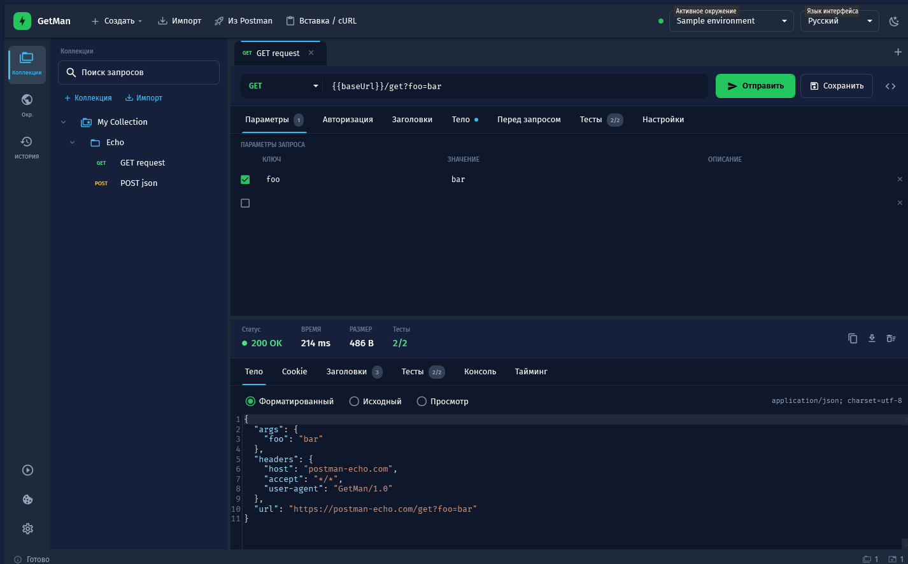
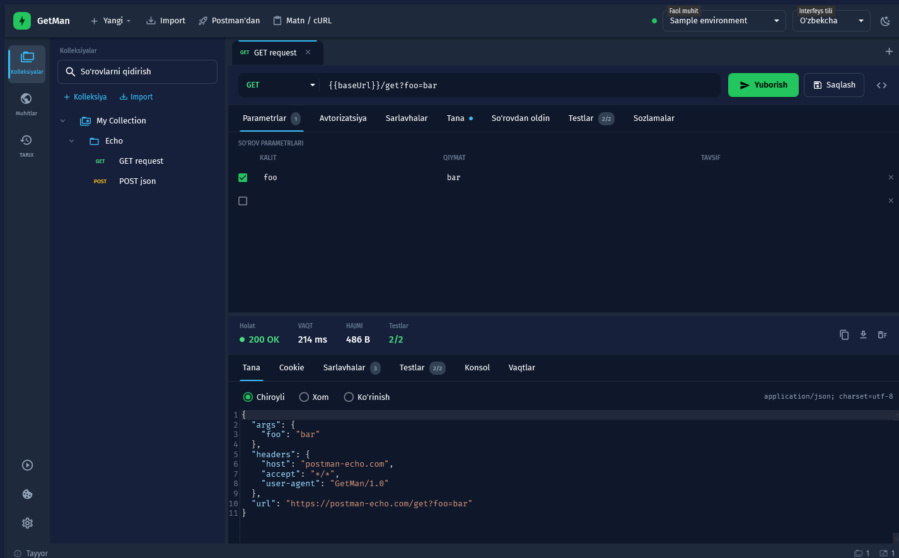
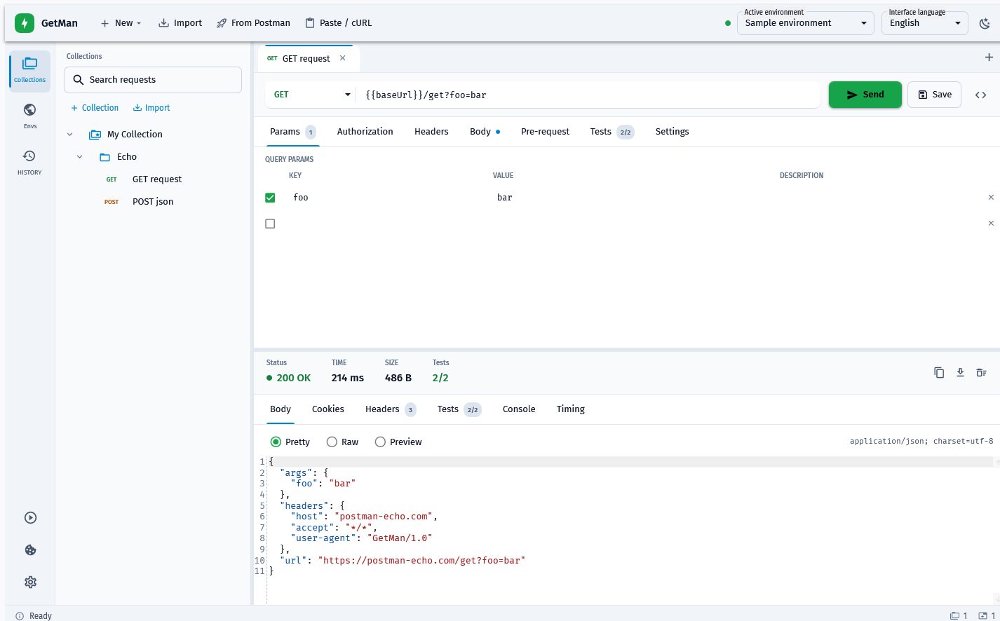
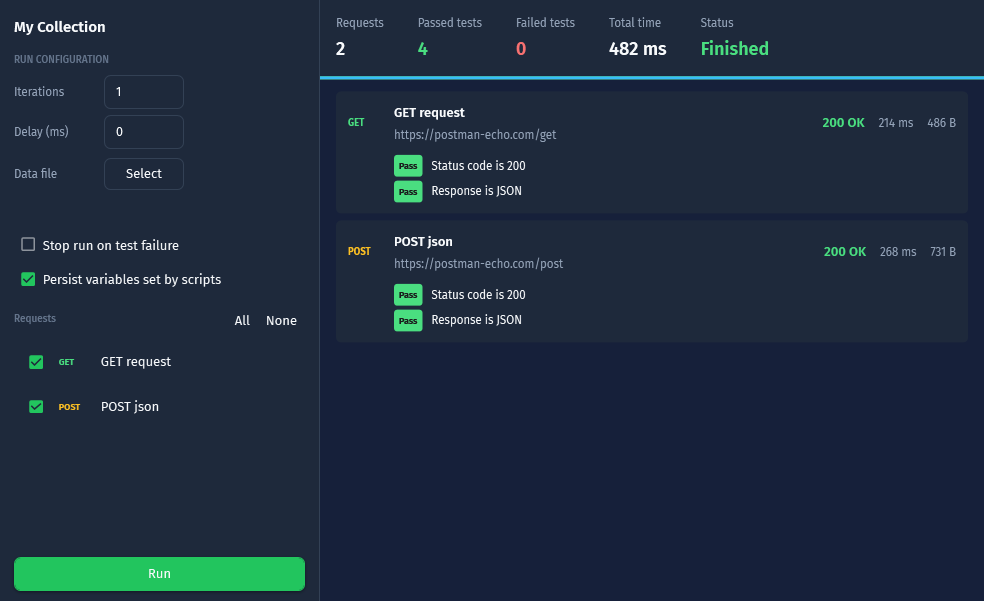
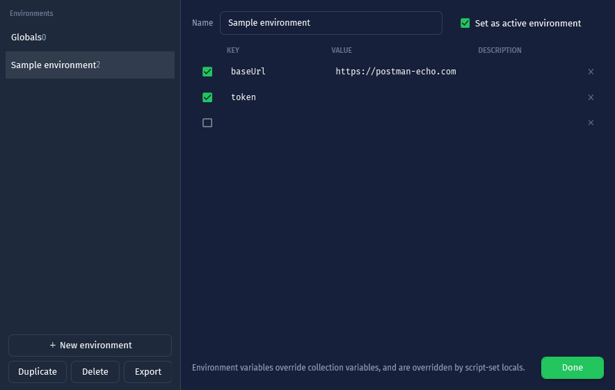
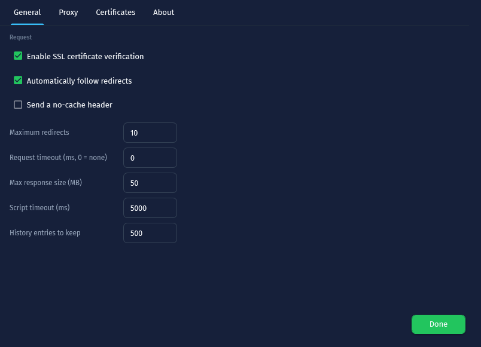
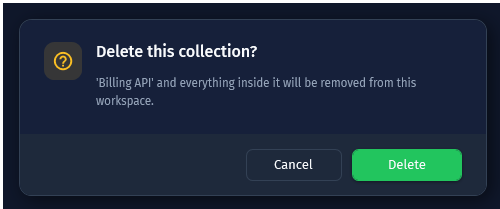

<div align="center">

# GetMan

**Нативный API-клиент для Windows — альтернатива Postman, которая умещается в один `.exe`.**

[](LICENSE)
[](https://dotnet.microsoft.com/)
[](#)
[](#языки-интерфейса)

[English](README.md) · **Русский** · [O'zbekcha](README.uz.md)



</div>

---

Написан на **WPF и .NET 9**, оформлен с помощью **MaterialDesignInXamlToolkit** (Material Design 3).
Без Electron, без Chromium, без фонового процесса node: один нативный `.exe`, который запускается
мгновенно и импортирует ваши существующие коллекции Postman как есть.

```
dotnet run --project src/GetMan            # запуск из исходников
dotnet publish src/GetMan -c Release -r win-x64 --self-contained true \
  -p:PublishSingleFile=true -o dist        # один файл GetMan.exe
```

Рабочее пространство хранится в `%APPDATA%\GetMan\workspace.json` (с резервной копией), отдельно у
каждого пользователя Windows. Никуда ничего не отправляется.

## Языки интерфейса

GetMan говорит на **английском, русском и узбекском**. Выберите язык в верхней панели — и каждая
надпись, подсказка, диалог и сообщение в строке состояния меняются сразу, без перезапуска. При
первом запуске GetMan берёт язык Windows, если это один из трёх, иначе английский. Выбор
сохраняется вместе с остальными настройками.

| | |
|---|---|
|  |  |
| English | O'zbekcha |

Все строки лежат в одном JSON-файле на язык в
[`src/GetMan/Assets/Lang/`](src/GetMan/Assets/Lang). Чтобы добавить четвёртый язык, достаточно
скопировать `en.json`, перевести значения и добавить одну запись в `Loc.Languages` — см.
[CONTRIBUTING.md](CONTRIBUTING.md). `GetMan.exe --self-check` роняет сборку, если в каком-то языке
не хватает ключа, так что переводы не расходятся незаметно.

## Скриншоты

| Светлая тема | Запуск коллекции |
|---|---|
|  |  |

| Окружения | Настройки |
|---|---|
|  |  |



---

## Как перенести коллекции из Postman

Кнопка **Из Postman** на панели открывает диалог с двумя надёжными путями:

- **На этом компьютере** — сканирует Downloads, Documents, Desktop и OneDrive в поисках
  `*.postman_collection.json`, `*.postman_environment.json`, глобальных переменных и полных дампов
  данных, показывает содержимое каждого файла (имя, тип, число запросов) и импортирует отмеченные.
  Можно указать и дополнительные папки.
- **Аккаунт Postman** — вставьте персональный API-ключ (postman.co → Settings → API keys), и GetMan
  через `api.getpostman.com` перечислит все коллекции и окружения аккаунта, а затем загрузит
  выбранные. Начиная с Postman 10 приложение синхронизируется с облаком, поэтому это ровно то, что
  показывает установленный Postman.

GetMan обнаруживает установленный Postman и сообщает его версию, но сознательно **не** пытается
читать его собственную базу: это Chromium IndexedDB (LevelDB + snappy + V8 structured clone), формат
недокументирован, меняется от версии к версии, а файлы заблокированы, пока Postman запущен. Попытка
вычитать её при тестировании не дала ни одной восстановимой коллекции, поэтому GetMan предлагает два
пути выше.

## Совместимость с Postman

**Импорт** — кнопка `Импорт`, `Ctrl+O` или `Вставка / cURL` для произвольного текста:

| Формат | Поддержка |
|---|---|
| Collection v2.1 | да |
| Collection v2.0 | да |
| Collection v1 (`requests` + `folders`) | да |
| Экспорт окружения / глобальных переменных | да |
| Дамп «Export data» из Postman (`collections` + `environments` + `globals`) | да |
| Команда cURL (кавычки bash или cmd) | да |

Переносится всё содержимое коллекции: вложенные папки, query-параметры (включая отключённые строки),
заголовки массивом *или* строкой с переносами, все режимы тела (`raw` с указанием языка,
`urlencoded`, `formdata` с файловыми полями, `file`, `graphql`), авторизация коллекции, папки и
запроса, pre-request и тестовые скрипты (`exec` массивом или одной строкой), переменные коллекции и
папки, path-переменные, объекты описаний и `protocolProfileBehavior` (`followRedirects`,
`strictSSL`, `maxRedirects`, `disableUrlEncoding`, `disableCookies`).

**Экспорт** — правый клик по коллекции → *Экспорт в Postman v2.1*, или экспорт любого окружения.
Экспортированные файлы чисто импортируются обратно и в Postman, и в GetMan.

**Не импортируется:** OpenAPI/Swagger, WSDL, HAR, Insomnia. Это отдельные форматы, а не коллекции
Postman.

---

## Что внутри

**Конструктор запросов**
- Все методы HTTP и произвольные (`PURGE`, `PROPFIND`, …)
- Строка URL синхронизирована с таблицей query-параметров в обе стороны; сегменты `:pathVariable`
  становятся редактируемыми строками
- Таблица заголовков с включением/отключением каждой строки и описаниями
- Тело: нет, form-data (с загрузкой файлов), x-www-form-urlencoded, raw
  (JSON/XML/HTML/JavaScript/текст с форматированием), бинарный файл, GraphQL (запрос + переменные)
- Настройки запроса: редиректы и их максимум, проверка SSL, кодирование URL, отправка и сохранение
  cookie, таймаут, версия HTTP (1.0/1.1/2/3)

**Авторизация** — Inherit, None, Bearer, Basic, API key (в заголовке или в query), OAuth 2.0
(client credentials, authorization code с PKCE и локальным слушателем redirect, password, refresh
token), Digest (ответ на challenge с MD5, MD5-sess, SHA-256), NTLM, AWS Signature v4 и Hawk.
Авторизация, заданная на коллекции или папке, наследуется вниз ровно как в Postman.

**Скрипты** — настоящая песочница JavaScript (Jint) с API Postman:
`pm.test`, `pm.expect` (библиотека утверждений в стиле chai: `equal`, `eql`, `a`/`an`,
`above`/`below`/`least`/`most`/`within`, `include`, `property`, `lengthOf`, `keys`, `members`,
`match`, `oneOf`, `empty`, `ok`, `true`/`false`/`null`/`undefined` и `.not` ко всем),
`pm.response.to.have.status/header/jsonBody/body`,
`pm.response.to.be.json/ok/success/clientError/serverError`,
`pm.environment` / `pm.globals` / `pm.collectionVariables` / `pm.variables` / `pm.iterationData`,
изменение `pm.request` (`headers.add/upsert/remove`, метод, url, тело), `pm.sendRequest`,
`pm.cookies`, `pm.info`, `pm.execution.setNextRequest`, `console.*`, а также устаревшие
`postman.setEnvironmentVariable`, `tests["name"] = …`, `responseCode`, `responseBody`, `xml2Json`,
`btoa`/`atob`. Скрипты коллекции → папки → запроса выполняются в этом порядке.

**Переменные** — глобальные, коллекции, папки, окружения, данных и локальные из скриптов с
приоритетом как в Postman, разрешение `{{вложенных}}` и динамические генераторы (`{{$guid}}`,
`{{$timestamp}}`, `{{$isoTimestamp}}`, `{{$randomInt}}` — включая `{{$randomInt(1,100)}}` —
`{{$randomFullName}}`, `{{$randomEmail}}` и ещё около 40). Неразрешённые токены остаются как есть,
а не превращаются в пустоту, — так видно, чего не хватает.

**Просмотр ответа** — Форматированный / Исходный / Просмотр, подсветка синтаксиса для JSON, XML/HTML
и JavaScript, отрисовка изображений, поиск по `Ctrl+F`, заголовки ответа, cookie, результаты тестов,
консоль и разбивка по времени (DNS, TCP, TLS, время до первого байта, загрузка, итог).

**Раннер коллекций** — выберите запросы, задайте число итераций и задержку, подайте данные из
CSV- или JSON-файла, останавливайтесь на первом провале, учитывайте `setNextRequest` и следите за
результатами тестов по каждому запросу вживую.

**Языки интерфейса** — английский, русский и узбекский, переключаются на лету из верхней панели.
См. [Языки интерфейса](#языки-интерфейса).

**Ещё** — общее хранилище cookie с менеджером, история запросов, генерация кода для 15 целей
(cURL, PowerShell, C#, Python, JavaScript fetch/axios, Node, Go, Java, PHP, Ruby, Rust, Dart,
сырой HTTP), вкладки запросов с отметкой несохранённых изменений, перетаскивание в дереве, системный
или свой прокси и клиентские сертификаты.

**Горячие клавиши** — `Ctrl+Enter` отправить · `Ctrl+S` сохранить · `Ctrl+N` новый запрос ·
`Ctrl+W` закрыть вкладку · `Ctrl+O` импорт · `Ctrl+E` окружения · `Ctrl+R` раннер ·
`Ctrl+Shift+D` светлая/тёмная тема · `F2` переименовать выбранный запрос, папку или коллекцию.

## Дизайн-система

Интерфейс следует дизайн-системе **инструмента разработчика / IDE** поверх Material Design 3
(MaterialDesignInXamlToolkit, MIT).

**Цвет.** Сланцевый холст и два акцента, которые никогда не подменяют друг друга: зелёный — действие
запуска, небесный — выделение и фокус. Цвета методов и статусов остаются семантическими поверх этого.

| Токен | Тёмная | Светлая | Для чего |
|---|---|---|---|
| `Bg0` … `Bg4` | `#0F172A` → `#334155` | `#FFFFFF` → `#DCE5EF` | холст, панель, хром, наведение, выделение |
| `Fg` / `FgDim` / `FgMuted` | `#F8FAFC` / `#94A3B8` / `#64748B` | `#0F172A` / `#475569` / `#64748B` | иерархия текста |
| `Action` | `#22C55E` | `#16A34A` | Отправить и все главные кнопки |
| `Accent` | `#38BDF8` | `#0284C7` | выделение, подчёркивание вкладки, кольцо фокуса, ссылки |

Контраст к холсту: `Fg` 16.4:1, `FgDim` 7.4:1, `FgMuted` 4.6:1 в тёмной теме; 17.9:1 / 7.5:1 /
4.8:1 в светлой — всё выше порога 4.5:1.

**Шрифт.** Fira Sans для интерфейса и Fira Mono для всего, что похоже на код (URL, заголовки, тела,
скрипты, сниппеты). Оба вшиты в бинарник под лицензией SIL Open Font и покрывают латиницу, кириллицу
и греческий.

**Раскладка.** Панель приложения высотой 52px, вертикальная панель значков 72px (Коллекции /
Окружения / История, с раннером, cookie и настройками внизу), сайдбар с изменяемой шириной и деление
«запрос над ответом». Отступы по шкале 4/8/12/16/24, скругления 5/8/12.

**Темы.** Тёмная по умолчанию, светлая в один клик (панель или `Ctrl+Shift+D`). Каждый цвет — токен
`DynamicResource`, поэтому `Themes/Tokens.Dark.xaml` и `Themes/Tokens.Light.xaml` меняются на лету —
включая подсветку синтаксиса в редакторе, у которой своя светлая палитра.

**Диаграммы.** Разбивка по времени — это составная полоса-водопад с легендой плюс те же числа
таблицей под ней: круговая диаграмма при таких пропорциях читалась бы хуже и была бы хуже для
программ чтения с экрана.

**Доступность.** Заметные небесные кольца фокуса на каждом интерактивном элементе,
`AutomationProperties.Name` на кнопках без подписи, пустые состояния, которые говорят, что делать
дальше, ошибки со значком и текстом, а не только цветом, и учёт настройки Windows «показывать
анимацию» — когда она выключена, все длительности обнуляются.

**Движение.** Всё интерактивное отвечает на указатель:

| Элемент | Наведение | Выбрано / нажато |
|---|---|---|
| Кнопки | увеличиваются, рамка теплеет к акценту | при нажатии уменьшаются, главная кнопка поднимается на ступень тени |
| Кнопки-значки | увеличиваются, окрашиваются в акцент | при нажатии уменьшаются |
| Кнопка «Отправить» | бумажный самолётик подаётся вперёд | — |
| Строки дерева и списка | заливка проявляется, содержимое сдвигается вправо | акцентная полоса выскакивает слева |
| Вкладки разделов | заливка проявляется, подпись светлеет | подчёркивание растёт из центра |
| Вкладки запросов | заливка проявляется, крестик из бледного становится плотным | акцентная полоса растёт вдоль верха |
| Раскрывающий значок дерева | шеврон окрашивается | поворачивается на 90° |
| Поля | мягкое свечение проявляется | ярче, пока поле в фокусе |
| Карточки | поднимаются на 2px, тень Dp1 → Dp3 | — |
| Разделители | акцент проявляется поверх линии | остаётся подсвеченным при перетаскивании |
| Панель ответа | — | поднимается на 14px и проявляется при каждом новом ответе |

Длительности 130–280 мс с кубическим ease-out — достаточно коротко, чтобы ощущаться мгновенно, — и
живут в ресурсах `DurFast` / `DurSlow` / `DurPop`, чтобы режим сниженной анимации мог их обнулить.
Эффекты держатся на двух механизмах: `Controls/HoverAssist.cs` (присоединённое свойство, дающее
любому элементу масштаб / подъём / сдвиг / поворот с трансформациями, создаваемыми в коде) и
слоистых оверлеях `Opacity` внутри шаблонов, которыми владеет GetMan, — так наведение и выделение
никогда не спорят за одну кисть. Ни одна кисть не анимируется: кисть, переданная в `Setter`,
замораживается при запечатывании стиля, и анимация упала бы во время выполнения.

`Themes/Tokens.*.xaml` хранят цветовые токены, `Themes/Typography.xaml` — шрифты и шкалу,
`Themes/Animations.xaml` — движение, а `Themes/Controls.xaml` — тонкий слой поверх стилей Material.
Меняйте их, чтобы перекрасить приложение.

---

## Структура

```
src/GetMan/
  Models/        модели запроса, коллекции, окружения и ответа
  Services/      HTTP-движок, резолвер переменных, среда скриптов, импорт/экспорт Postman,
                 импорт cURL, генерация кода, сохранение
  ViewModels/    MainViewModel, RequestTabViewModel
  Views/         редакторы запроса/ответа и диалоговые окна
  Controls/      хост AvalonEdit, таблица ключ-значение, конвертеры
  Themes/        цвета и стили элементов управления
tools/SelfTest/  headless-набор тестов по всему слою сервисов
```

## Тесты

```
dotnet run --project tools/SelfTest                      # включая живой HTTP к postman-echo
dotnet run --project tools/SelfTest -- --offline         # без сетевого раздела
dotnet run --project tools/SelfTest -- --import a.json   # импорт реальных коллекций и round-trip
dotnet run --project tools/SelfTest -- --unicode         # только кириллица / CJK / эмодзи

GetMan.exe --self-check                                  # строит все окна, затем прогоняет реальные
                                                         # сценарии (фокус переименования, создание,
                                                         # поиск, перетаскивание, вкладки, тема)
GetMan.exe --render auth shot.png [light]                # отрисовать одно представление для ревью
GetMan.exe --shots docs/images                           # пересобрать все скриншоты документации
powershell -File tools/capture.ps1 -Out shot.png         # снимок запущенного приложения
powershell -File tools/capture.ps1 -HoverX 115 -HoverY 244  # ...с указателем на месте, чтобы показать наведение
```

Набор покрывает импорт коллекций (v1/v2.0/v2.1 плюс неудобные реальные формы), импорт окружений,
round-trip экспорта, обнаружение локального Postman, приоритет переменных и динамические переменные,
разбор cURL, подготовку запроса и наследование авторизации, подпись AWS SigV4 / Digest / Hawk,
генерацию кода, весь API `pm.*`, живой HTTP
(GET/POST/form/multipart/basic-auth/cookies/404/отказ DNS) и сквозной прогон, где скрипт коллекции,
скрипт запроса, сам запрос и его тесты должны сойтись.

---

## Участие в проекте

Отчёты об ошибках, переводы и pull request'ы приветствуются. Начните с
[CONTRIBUTING.md](CONTRIBUTING.md) — там про сборку, два набора тестов, которые обязан пройти любой
патч, и про то, как добавить или поправить язык. От всех участников ожидается соблюдение
[кодекса поведения](CODE_OF_CONDUCT.md). Для проблем безопасности отдельный путь:
[SECURITY.md](SECURITY.md).

## Лицензия

[MIT](LICENSE) © участники GetMan.

GetMan стоит на чужой работе:
[MaterialDesignInXamlToolkit](https://github.com/MaterialDesignInXAML/MaterialDesignInXamlToolkit)
(MIT), [AvalonEdit](https://github.com/icsharpcode/AvalonEdit) (MIT),
[Jint](https://github.com/sebastienros/jint) (BSD-2-Clause),
[CommunityToolkit.Mvvm](https://github.com/CommunityToolkit/dotnet) (MIT) и
[Fira Sans / Fira Mono](https://github.com/mozilla/Fira) (SIL Open Font License 1.1).

GetMan не связан с Postman, Inc. Название «Postman» используется только для описания форматов файлов
и API, которые читает GetMan.
